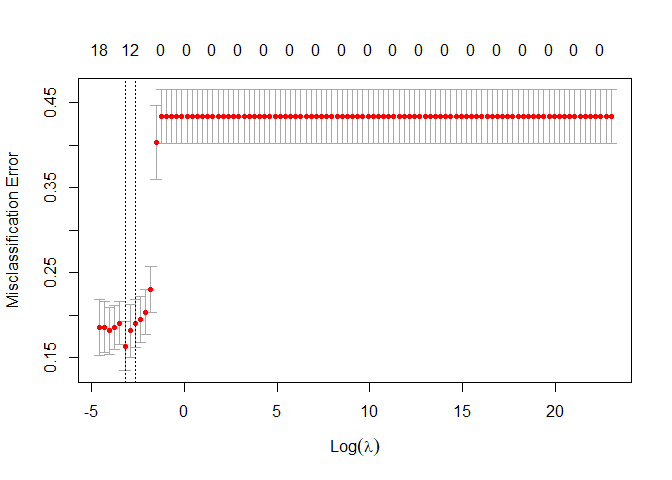
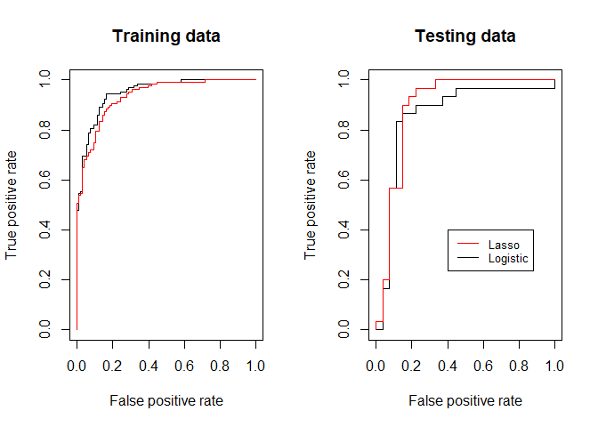

Case study 3
================
Sandy Vo
8/7/2022

``` r
df <- read.csv("C:/Users/tv/Desktop/Machine learning I/dfex.csv")
```

``` r
cols <- c("sex","cp","fbs", "restecg", "exang", "slope", "ca", "thal", "target")
df[cols] <- lapply(df[cols], factor)
```

``` r
set.seed(123)
train <- sample(1:nrow(df),size = round(nrow(df)*0.8))
train.set <- df[train,]
test.set <- df[-train,]
```

``` r
logit.mod <- glm( target ~., data = train.set, family = binomial)
summary(logit.mod)
```

    ## 
    ## Call:
    ## glm(formula = target ~ ., family = binomial, data = train.set)
    ## 
    ## Deviance Residuals: 
    ##      Min        1Q    Median        3Q       Max  
    ## -2.57141  -0.23096   0.07027   0.39357   2.70082  
    ## 
    ## Coefficients:
    ##                                  Estimate Std. Error z value Pr(>|z|)    
    ## (Intercept)                     1.113e+01  4.180e+00   2.662  0.00777 ** 
    ## age                             1.883e-02  3.055e-02   0.616  0.53770    
    ## sexMale                        -1.290e+00  6.984e-01  -1.847  0.06480 .  
    ## cpatypical_angina              -1.330e+00  9.082e-01  -1.465  0.14299    
    ## cpnon-anginal pain              6.068e-01  8.095e-01   0.750  0.45346    
    ## cptypical_angina               -2.247e+00  8.309e-01  -2.705  0.00684 ** 
    ## trestbps                       -4.077e-02  1.667e-02  -2.446  0.01446 *  
    ## chol                           -6.121e-03  6.198e-03  -0.987  0.32341    
    ## fbsYes                          6.278e-01  7.182e-01   0.874  0.38201    
    ## restecgNormal                  -1.042e+00  5.255e-01  -1.984  0.04731 *  
    ## restecgVentricular_hypertrophy -1.200e+01  1.455e+03  -0.008  0.99342    
    ## thalach                         6.510e-03  1.560e-02   0.417  0.67638    
    ## exangYes                       -3.571e-01  5.536e-01  -0.645  0.51891    
    ## oldpeak                        -8.772e-01  3.337e-01  -2.628  0.00858 ** 
    ## slopeflat                      -1.063e+00  5.881e-01  -1.808  0.07063 .  
    ## slopeupsloping                 -9.100e-01  1.153e+00  -0.789  0.42987    
    ## ca1                            -2.534e+00  6.551e-01  -3.867  0.00011 ***
    ## ca2                            -3.130e+00  9.597e-01  -3.261  0.00111 ** 
    ## ca3                            -2.030e+00  1.041e+00  -1.951  0.05107 .  
    ## thalnormal                     -1.031e+00  1.001e+00  -1.030  0.30279    
    ## thalreversable_defect          -2.141e+00  5.949e-01  -3.598  0.00032 ***
    ## ---
    ## Signif. codes:  0 '***' 0.001 '**' 0.01 '*' 0.05 '.' 0.1 ' ' 1
    ## 
    ## (Dispersion parameter for binomial family taken to be 1)
    ## 
    ##     Null deviance: 309.31  on 225  degrees of freedom
    ## Residual deviance: 126.40  on 205  degrees of freedom
    ## AIC: 168.4
    ## 
    ## Number of Fisher Scoring iterations: 14

``` r
logit.pred <- predict(logit.mod, test.set, type = "response")
logit.class <- ifelse(logit.pred > 0.5, "Yes", "No")
table(Predicted = logit.class, Actual = test.set$target)
```

    ##          Actual
    ## Predicted No Yes
    ##       No  20   3
    ##       Yes  7  27

``` r
mean(test.set$target == logit.class)
```

    ## [1] 0.8245614

``` r
# run lasso with 100 lambda
x <- model.matrix(target ~ ., train.set)[,-1]
y <- train.set$target
lambda <- 10^seq(10,-2,length = 100)
```

``` r
library(glmnet)
```

    ## Warning: package 'glmnet' was built under R version 4.1.3

    ## Loading required package: Matrix

    ## Loaded glmnet 4.1-4

``` r
set.seed(42)
cv.lasso <- cv.glmnet(x = x, y = y, family = "binomial", standardize = T, alpha = 1, lambda = lambda, type.measure = "class")
lambda.min <- cv.lasso$lambda.min
lambda.min
```

    ## [1] 0.04037017

``` r
plot(cv.lasso)
```

<!-- -->

``` r
# run lasso with the best lambda
lasso.model <- glmnet(x, y, alpha = 1, family = "binomial",
                      lambda = lambda.min)
coef(lasso.model)
```

    ## 21 x 1 sparse Matrix of class "dgCMatrix"
    ##                                          s0
    ## (Intercept)                     2.047760198
    ## age                             .          
    ## sexMale                        -0.466397951
    ## cpatypical_angina               .          
    ## cpnon-anginal pain              0.281560521
    ## cptypical_angina               -1.018672914
    ## trestbps                       -0.007650157
    ## chol                            .          
    ## fbsYes                          .          
    ## restecgNormal                  -0.108477507
    ## restecgVentricular_hypertrophy  .          
    ## thalach                         0.009019850
    ## exangYes                       -0.227328373
    ## oldpeak                        -0.394975535
    ## slopeflat                      -0.355836470
    ## slopeupsloping                  .          
    ## ca1                            -0.762057274
    ## ca2                            -0.957786783
    ## ca3                            -0.206152328
    ## thalnormal                      .          
    ## thalreversable_defect          -0.970545530

``` r
x.test <- model.matrix(target ~ ., test.set)[,-1]

lasso.pred <- predict(lasso.model, x.test, type = "response")
lasso.class <- ifelse(lasso.pred > 0.5, "Yes", "No")
```

``` r
observed.classes <- test.set$target
table(Predicted = lasso.class, Actual = test.set$target)
```

    ##          Actual
    ## Predicted No Yes
    ##       No  21   1
    ##       Yes  6  29

``` r
mean(lasso.class == observed.classes)
```

    ## [1] 0.877193

``` r
# plot ROC
library (ROCR)
```

    ## Warning: package 'ROCR' was built under R version 4.1.3

``` r
rocplot =function (pred , truth , ...){
  predob = prediction (pred , truth)
  perf = performance(predob , "tpr", "fpr")
  plot(perf ,...)}
```

``` r
par(mfrow = c(1,2))
lasso.fitted <- predict(lasso.model, x, type = "response")

# ROC on training set
rocplot(logit.mod$fitted.values, train.set$target, main = "Training data")
rocplot(lasso.fitted, train.set$target, add = T, col = "red")

#ROC on test set
rocplot(logit.pred, test.set$target, main = "Testing data")
rocplot(lasso.pred, test.set$target, add = T, col = "red")

legend(0.4, 0.4, legend=c("Lasso", "Logistic"),
       col=c("red", "black"), lty=1, cex=0.8)
```

<!-- -->

``` r
#find the best cut-off
opt.cut = function(perf, pred){
    cut.ind = mapply(FUN=function(x, y, p){
        d = (x - 0)^2 + (y-1)^2
        ind = which(d == min(d))
        c(sensitivity = y[[ind]], specificity = 1-x[[ind]], 
            cutoff = p[[ind]])
    }, perf@x.values, perf@y.values, pred@cutoffs)
}
```

``` r
#best cut-off for logistic model
pred1 <- prediction (logit.pred , test.set$target)
roc.perf1 <- performance(pred1, measure = "tpr", x.measure = "fpr")
print(opt.cut(roc.perf1, pred1))
```

    ##                  [,1]
    ## sensitivity 0.8666667
    ## specificity 0.8518519
    ## cutoff      0.7852687

``` r
# best cut-off for lasso model
pred2 <- prediction (lasso.pred , test.set$target)
roc.perf2 <- performance(pred2, measure = "tpr", x.measure = "fpr")
print(opt.cut(roc.perf2, pred2))
```

    ##                  [,1]
    ## sensitivity 0.9000000
    ## specificity 0.8518519
    ## cutoff      0.6041315

``` r
#best cut-off for logistic model with False negative = 10 times False positve
cost.perf1 = performance(pred1, "cost", cost.fp = 1, cost.fn = 10)
pred1@cutoffs[[1]][which.min(cost.perf1@y.values[[1]])]
```

    ##        145 
    ## 0.09283595

``` r
#best cut-off for lasso model with False negative = 10 times False positve
cost.perf2 = performance(pred1, "cost", cost.fp = 1, cost.fn = 10)
pred2@cutoffs[[1]][which.min(cost.perf2@y.values[[1]])]
```

    ## [1] 0.3717579

``` r
#confusion matrix for the above best cut-off for each model
table(Predicted = ifelse(logit.pred > pred1@cutoffs[[1]][which.min(cost.perf1@y.values[[1]])], "Yes", "No"), Actual = test.set$target)
```

    ##          Actual
    ## Predicted No Yes
    ##       No  15   2
    ##       Yes 12  28

``` r
table(Predicted = ifelse(lasso.pred > pred2@cutoffs[[1]][which.min(cost.perf1@y.values[[1]])], "Yes", "No"), Actual = test.set$target)
```

    ##          Actual
    ## Predicted No Yes
    ##       No  17   0
    ##       Yes 10  30
