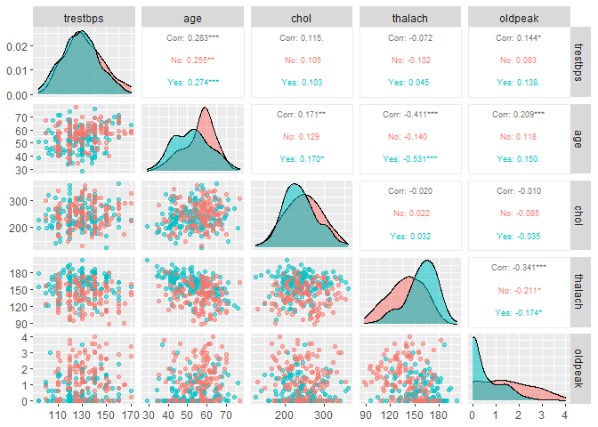

Project - part 1
================
Sandy Vo
7/22/2022

#The data file has 303 records and 14 variables

``` r
df <- read.csv("heart-disease.csv")
head(df)
```

    ##   ï..age sex cp trestbps chol fbs restecg thalach exang oldpeak slope ca thal
    ## 1     63   1  3      145  233   1       0     150     0     2.3     0  0    1
    ## 2     37   1  2      130  250   0       1     187     0     3.5     0  0    2
    ## 3     41   0  1      130  204   0       0     172     0     1.4     2  0    2
    ## 4     56   1  1      120  236   0       1     178     0     0.8     2  0    2
    ## 5     57   0  0      120  354   0       1     163     1     0.6     2  0    2
    ## 6     57   1  0      140  192   0       1     148     0     0.4     1  0    1
    ##   target
    ## 1      1
    ## 2      1
    ## 3      1
    ## 4      1
    ## 5      1
    ## 6      1

``` r
dim(df)
```

    ## [1] 303  14

#Change the age column name

``` r
colnames(df)
```

    ##  [1] "ï..age"   "sex"      "cp"       "trestbps" "chol"     "fbs"     
    ##  [7] "restecg"  "thalach"  "exang"    "oldpeak"  "slope"    "ca"      
    ## [13] "thal"     "target"

``` r
names(df)[names(df) == "ï..age"] <- "age"
```

There is 2 identical rows in the dataset. After removing the duplicate
values, the dataset has 302 observations.

``` r
df[duplicated(df),]
```

    ##     age sex cp trestbps chol fbs restecg thalach exang oldpeak slope ca thal
    ## 165  38   1  2      138  175   0       1     173     0       0     2  4    2
    ##     target
    ## 165      1

``` r
df <- df[!duplicated(df),]
dim(df)
```

    ## [1] 302  14

Check if each field in the data is numeric or not

The dataset has 9 categorical variables; however, the dataset failed to
classify them. They are all displayed in numeric values.

``` r
apply(df,2,is.numeric)
```

    ##      age      sex       cp trestbps     chol      fbs  restecg  thalach 
    ##     TRUE     TRUE     TRUE     TRUE     TRUE     TRUE     TRUE     TRUE 
    ##    exang  oldpeak    slope       ca     thal   target 
    ##     TRUE     TRUE     TRUE     TRUE     TRUE     TRUE

``` r
lapply(apply(df,2, unique),length)
```

    ## $age
    ## [1] 41
    ## 
    ## $sex
    ## [1] 2
    ## 
    ## $cp
    ## [1] 4
    ## 
    ## $trestbps
    ## [1] 49
    ## 
    ## $chol
    ## [1] 152
    ## 
    ## $fbs
    ## [1] 2
    ## 
    ## $restecg
    ## [1] 3
    ## 
    ## $thalach
    ## [1] 91
    ## 
    ## $exang
    ## [1] 2
    ## 
    ## $oldpeak
    ## [1] 40
    ## 
    ## $slope
    ## [1] 3
    ## 
    ## $ca
    ## [1] 5
    ## 
    ## $thal
    ## [1] 4
    ## 
    ## $target
    ## [1] 2

Errors in variables ca and thal:

ca has 4 levels corresponding to 0, 1, 2 and 3. But the dataset fails to
classify categorical variables. There is 4 rows in the dataset marked
with 4. So I replace 4 with the median of the variable ca.

thal has 3 levels (1,2, and 3). But the dataset fails to classify
categorical variables. There is 2 rows in the dataset marked with 0. So
I replace 0 with the median of the variable thal.

``` r
table(df$ca)
```

    ## 
    ##   0   1   2   3   4 
    ## 175  65  38  20   4

``` r
df[df$ca == 4,]$ca = NA
unique(df$ca)
```

    ## [1]  0  2  1  3 NA

``` r
table(df$thal)
```

    ## 
    ##   0   1   2   3 
    ##   2  18 165 117

``` r
df[df$thal == 0,]$thal = NA
unique(df$thal)
```

    ## [1]  1  2  3 NA

``` r
apply(apply(df,2,is.na),2,sum)
```

    ##      age      sex       cp trestbps     chol      fbs  restecg  thalach 
    ##        0        0        0        0        0        0        0        0 
    ##    exang  oldpeak    slope       ca     thal   target 
    ##        0        0        0        4        2        0

``` r
df$ca[is.na(df$ca)] <- median(df$ca, na.rm = TRUE)
df$thal[is.na(df$thal)] <- median(df$thal, na.rm = TRUE)
```

Replace numbers in categorical variables with meaningful tags.

``` r
library(car)
```

    ## Warning: package 'car' was built under R version 4.1.3

    ## Loading required package: carData

    ## Warning: package 'carData' was built under R version 4.1.3

``` r
str(df)
```

    ## 'data.frame':    302 obs. of  14 variables:
    ##  $ age     : int  63 37 41 56 57 57 56 44 52 57 ...
    ##  $ sex     : int  1 1 0 1 0 1 0 1 1 1 ...
    ##  $ cp      : int  3 2 1 1 0 0 1 1 2 2 ...
    ##  $ trestbps: int  145 130 130 120 120 140 140 120 172 150 ...
    ##  $ chol    : int  233 250 204 236 354 192 294 263 199 168 ...
    ##  $ fbs     : int  1 0 0 0 0 0 0 0 1 0 ...
    ##  $ restecg : int  0 1 0 1 1 1 0 1 1 1 ...
    ##  $ thalach : int  150 187 172 178 163 148 153 173 162 174 ...
    ##  $ exang   : int  0 0 0 0 1 0 0 0 0 0 ...
    ##  $ oldpeak : num  2.3 3.5 1.4 0.8 0.6 0.4 1.3 0 0.5 1.6 ...
    ##  $ slope   : int  0 0 2 2 2 1 1 2 2 2 ...
    ##  $ ca      : num  0 0 0 0 0 0 0 0 0 0 ...
    ##  $ thal    : num  1 2 2 2 2 1 2 3 3 2 ...
    ##  $ target  : int  1 1 1 1 1 1 1 1 1 1 ...

``` r
df$sex <- recode(df$sex, "0 = 'Female'; 1 = 'Male'")
df$cp <- recode(df$cp, "0 = 'typical_angina'; 1 = 'atypical_angina'; 2 = 'non-anginal pain'; 3 = 'asymtomatic'")
df$fbs <- recode(df$fbs, "0 = 'No'; 1 = 'Yes'")
df$restecg <- recode(df$restecg, "0 = 'Normal'; 1 = 'Abnormal'; 2 = 'Ventricular_hypertrophy'")
df$exang <- recode(df$exang, "0 = 'No'; 1 = 'Yes'")
df$slope <- recode(df$slope, "0 = 'upsloping'; 1 = 'flat'; 2 = 'downsloping'")
df$thal <- recode(df$thal, "1 = 'normal'; 2 = 'fixed_defect'; 3 = 'reversable_defect'")
df$target <- recode(df$target, "0 = 'No'; 1 = 'Yes'")
cols <- c("sex","cp","fbs", "restecg", "exang", "slope", "ca", "thal", "target")
df[cols] <- lapply(df[cols], factor)

str(df)
```

    ## 'data.frame':    302 obs. of  14 variables:
    ##  $ age     : int  63 37 41 56 57 57 56 44 52 57 ...
    ##  $ sex     : Factor w/ 2 levels "Female","Male": 2 2 1 2 1 2 1 2 2 2 ...
    ##  $ cp      : Factor w/ 4 levels "asymtomatic",..: 1 3 2 2 4 4 2 2 3 3 ...
    ##  $ trestbps: int  145 130 130 120 120 140 140 120 172 150 ...
    ##  $ chol    : int  233 250 204 236 354 192 294 263 199 168 ...
    ##  $ fbs     : Factor w/ 2 levels "No","Yes": 2 1 1 1 1 1 1 1 2 1 ...
    ##  $ restecg : Factor w/ 3 levels "Abnormal","Normal",..: 2 1 2 1 1 1 2 1 1 1 ...
    ##  $ thalach : int  150 187 172 178 163 148 153 173 162 174 ...
    ##  $ exang   : Factor w/ 2 levels "No","Yes": 1 1 1 1 2 1 1 1 1 1 ...
    ##  $ oldpeak : num  2.3 3.5 1.4 0.8 0.6 0.4 1.3 0 0.5 1.6 ...
    ##  $ slope   : Factor w/ 3 levels "downsloping",..: 3 3 1 1 1 2 2 1 1 1 ...
    ##  $ ca      : Factor w/ 4 levels "0","1","2","3": 1 1 1 1 1 1 1 1 1 1 ...
    ##  $ thal    : Factor w/ 3 levels "fixed_defect",..: 2 1 1 1 1 2 1 3 3 1 ...
    ##  $ target  : Factor w/ 2 levels "No","Yes": 2 2 2 2 2 2 2 2 2 2 ...

``` r
library(reshape)
```

    ## Warning: package 'reshape' was built under R version 4.1.3

``` r
meltData <- melt(df)
```

    ## Using sex, cp, fbs, restecg, exang, slope, ca, thal, target as id variables

``` r
library(ggplot2)
library(ggthemes)
```

    ## Warning: package 'ggthemes' was built under R version 4.1.3

``` r
p <- ggplot(meltData, aes(variable, value)) 
p + geom_boxplot() + facet_wrap(~variable, scale="free") + ggtitle("Numerical variables") +  theme(plot.title = element_text(hjust = 0.5)) + theme_wsj()
```

<!-- -->

Apart from age, the are some outliers that will potentially affect the
accuracy of the prediction model. So we have to detele them.

``` r
#create a function to remove outliers
continous_features = c('trestbps','age','chol','thalach','oldpeak') 
outliers <- function(df_out, group, drop){
    for (each_feature in colnames(df_out[,group])){
        feature_data = df_out[[each_feature]]
       
        Q = quantile(feature_data, probs = c(0.25, 0.75))
        
        IQR = Q[2] - Q[1]
        
        outlier_step = IQR*1.5 
        outlier = which(feature_data < (Q[1] - outlier_step) | feature_data > (Q[2] + outlier_step))
        if (drop == FALSE){
        print(sprintf("For the feature %s, No of Outliers is %.0f",each_feature, length(outlier)))}
        else{
          if (length(outlier) == 0){next}
          else{df_out <- df_out[-outlier,]
          }
          }
        } 
  return(df_out)
    }

df_output <- outliers(df, continous_features ,drop = TRUE)
```

After removing outliers, the dataset is left with 283 observations.

``` r
library(broom)
```

    ## Warning: package 'broom' was built under R version 4.1.3

``` r
library(tidyverse)
```

    ## Warning: package 'tidyverse' was built under R version 4.1.3

    ## -- Attaching packages --------------------------------------- tidyverse 1.3.1 --

    ## v tibble  3.1.8     v dplyr   1.0.9
    ## v tidyr   1.2.0     v stringr 1.4.0
    ## v readr   2.1.2     v forcats 0.5.1
    ## v purrr   0.3.4

    ## Warning: package 'tibble' was built under R version 4.1.3

    ## Warning: package 'tidyr' was built under R version 4.1.3

    ## Warning: package 'readr' was built under R version 4.1.3

    ## Warning: package 'purrr' was built under R version 4.1.3

    ## Warning: package 'dplyr' was built under R version 4.1.3

    ## Warning: package 'stringr' was built under R version 4.1.3

    ## Warning: package 'forcats' was built under R version 4.1.3

    ## -- Conflicts ------------------------------------------ tidyverse_conflicts() --
    ## x tidyr::expand() masks reshape::expand()
    ## x dplyr::filter() masks stats::filter()
    ## x dplyr::lag()    masks stats::lag()
    ## x dplyr::recode() masks car::recode()
    ## x dplyr::rename() masks reshape::rename()
    ## x purrr::some()   masks car::some()

``` r
library(ggplot2)
```

``` r
model <- glm(target ~., data = df, 
               family = binomial)

model.data <- augment(model) %>% 
  mutate(index = 1:n()) 

ggplot(model.data, aes(index, .std.resid)) + 
  geom_point(aes(color = target), alpha = .5) +
  theme_bw() + labs(color = "Heart disease")
```

<!-- -->

The scatter plot above shows the relationship between the studentized
residuals of the logistic regression with target as a response and the
other variables as predictors.

Observations whose studentized residuals are greater than 3 in absolute
value are possible outliers. We can see that all the observations’
studentized residuals stays within -2 and 2. So there are no outliers
left in the dataset.

``` r
df <- df_output
dim(df)
```

    ## [1] 283  14

``` r
ggplot(df, aes(x = target, fill = target)) +
  geom_bar() +
  geom_text(aes(label = ..count..), stat = "count", vjust = 1.5, colour = "white") +
  ggtitle("Heart Disease Classes") + theme(plot.title = element_text(hjust = 0.5)) + 
  xlab("Sufferring of Heart disease") + ylab("Number of individuals") + theme_economist() + labs(fill = "Heart disease") + theme(plot.title = element_text(hjust = 0.5))
```

<!-- -->

We have 158 examples where someone has heart disease based on their
health parameters and 125 examples where someone doesn’t have heart
disease. So that’s a quite balanced classification problem.

``` r
pairs(df[,continous_features], col= hcl.colors(2, "Temps")[df$target])
```

<!-- -->

``` r
library(GGally)
```

    ## Warning: package 'GGally' was built under R version 4.1.3

    ## Registered S3 method overwritten by 'GGally':
    ##   method from   
    ##   +.gg   ggplot2

``` r
ggpairs(df, columns = continous_features, aes(color = target, alpha = 0.5),
        upper = list(continuous = wrap("cor", size = 2.5)))
```

<!-- -->

-   oldpeak having a linear separation relation between disease and
    non-disease.
-   thalach having a mild separation relation between disease and
    non-disease.
-   Other features don’t form any clear separation

``` r
library(dplyr)
t1 <- df %>%                       
  group_by(sex,target) %>% 
  dplyr::summarize(count = n())
```

    ## `summarise()` has grouped output by 'sex'. You can override using the `.groups`
    ## argument.

``` r
ggplot(t1, aes(sex, count, fill = target)) + 
  geom_col(position = "dodge") +
  geom_text(aes(label = count),
    colour = "white", size = 3,
    vjust = 1.5, position = position_dodge(.9)) +
  theme_bw() + 
xlab("Sex") + ylab("Frequency") + ggtitle("Sex Distribution according to Heart disease status") + labs(fill = "Heart disease") + theme(plot.title = element_text(hjust = 0.5))
```

<!-- -->

``` r
df %>%group_by(sex, target) %>%
summarise(cnt = n()) %>%
mutate(freq = (cnt / sum(cnt)))
```

    ## `summarise()` has grouped output by 'sex'. You can override using the `.groups`
    ## argument.

    ## # A tibble: 4 x 4
    ## # Groups:   sex [2]
    ##   sex    target   cnt  freq
    ##   <fct>  <fct>  <int> <dbl>
    ## 1 Female No        17 0.2  
    ## 2 Female Yes       68 0.8  
    ## 3 Male   No       108 0.545
    ## 4 Male   Yes       90 0.455

The graph show that there is an imbalance in sex (only 85 women out of
283 individuals).

Looking at the graph, we can observe that, in among each subgroup of
sex, only 20% of female is patient, while it is 54.54% of patients in
male subgroup. So it can be concluded that female is more likely to
suffer from heart disease than male (as shown in the dataset).

``` r
t2 <- df %>%                       
  group_by(cp,target) %>% 
  dplyr::summarize(count = n())
```

    ## `summarise()` has grouped output by 'cp'. You can override using the `.groups`
    ## argument.

``` r
ggplot(data = t2, aes(cp, count, fill = target)) + 
    geom_col(position = "dodge") +
  geom_text(aes(label = count),
    colour = "white", size = 3,
    vjust = 1.5, position = position_dodge(.9))  + xlab("Chest pain type") + ylab("Frequency") + ggtitle("Chest Pain Distribution according to Target") + labs(fill = "Heart disease") + theme(plot.title = element_text(hjust = 0.5)) + theme(axis.text.x = element_text(angle = 45, hjust=1))
```

<!-- -->

``` r
df %>%group_by(cp, target) %>%
summarise(count = n()) %>%
mutate(percent = (count / sum(count)))
```

    ## `summarise()` has grouped output by 'cp'. You can override using the `.groups`
    ## argument.

    ## # A tibble: 8 x 4
    ## # Groups:   cp [4]
    ##   cp               target count percent
    ##   <fct>            <fct>  <int>   <dbl>
    ## 1 asymtomatic      No         7   0.318
    ## 2 asymtomatic      Yes       15   0.682
    ## 3 atypical_angina  No         8   0.163
    ## 4 atypical_angina  Yes       41   0.837
    ## 5 non-anginal pain No        17   0.207
    ## 6 non-anginal pain Yes       65   0.793
    ## 7 typical_angina   No        93   0.715
    ## 8 typical_angina   Yes       37   0.285

We all think that chest pain of all types are one of the important
symptoms of heart diseases. Surprisingly, while it is true for
typical-anginal; asymptomatic, atypical angina and non-anginal pain do
not cause heart diseases (at least in the dataset). According to the
table, the proportion of patient in each subgroup of chest pain type,
asymptomatic, atypical angina and non-anginal pain is 68.18%, 83.67% and
79.27% respectively (much higher than 50%).

However, only 28.46% of patient is typical-anginal (about 1/3 of
non-patient in this subgroup). So chest pain might be a strong predictor
of heart diseases.

In addition, chest pain is also imbalanced, which is 130 out of 283
observations is typical_angina (nearly 50%). The smallest proportion is
for asymptomatic (only 22 out of 283 observations).

``` r
t3 <- df %>%                       
  group_by(fbs,target) %>% 
  dplyr::summarize(count = n())
```

    ## `summarise()` has grouped output by 'fbs'. You can override using the `.groups`
    ## argument.

``` r
ggplot(data = t3, aes(fbs, count, fill = target)) + 
    geom_col(position = "dodge") +
  geom_text(aes(label = count),
    colour = "white", size = 3,
    vjust = 1.5, position = position_dodge(.9)) + xlab("Fasting blood sugar") + ylab("Frequency") + ggtitle("Fasting blood sugar \n distribution according to Heart disease") + labs(fill = "Heart disease") + theme(plot.title = element_text(hjust = 0.5))
```

<!-- -->
It is noticeable that the number of people with non fasting blood sugar
is much higher than that number of people with fasting blood sugar.

``` r
df %>%group_by(fbs, target) %>%
summarise(count = n()) %>%
mutate(percent = (count / sum(count)))
```

    ## `summarise()` has grouped output by 'fbs'. You can override using the `.groups`
    ## argument.

    ## # A tibble: 4 x 4
    ## # Groups:   fbs [2]
    ##   fbs   target count percent
    ##   <fct> <fct>  <int>   <dbl>
    ## 1 No    No       106   0.436
    ## 2 No    Yes      137   0.564
    ## 3 Yes   No        19   0.475
    ## 4 Yes   Yes       21   0.525

Looking at the table, we can see that the proportion of patient in each
subgroup of fbs is quite equal to that of non-patients, which indicates
that fbs may not a strong predictor (at least in this dataset).

``` r
t4 <- df %>%                       
  group_by(slope,target) %>% summarise(count = n())
```

    ## `summarise()` has grouped output by 'slope'. You can override using the
    ## `.groups` argument.

``` r
ggplot(data = t4, aes(slope, count, fill = target)) + 
    geom_col(position = "dodge") +
  geom_text(aes(label = count),
    colour = "white", size = 3,
    vjust = 1.5, position = position_dodge(.9)) + xlab("Slope") + ylab("Frequency") + ggtitle("Slope of the peak exercise ST segment \n distribution according to Heart disease") + labs(fill = "Heart disease") + theme(plot.title = element_text(hjust = 0.5))
```

<!-- -->

Firstly, it can be observed that upsloping accounts for a small amount
in slope, which means that slope is imbalanced.

``` r
df %>%group_by(slope, target) %>%
summarise(count = n()) %>%
mutate(percent = (count / sum(count)))
```

    ## `summarise()` has grouped output by 'slope'. You can override using the
    ## `.groups` argument.

    ## # A tibble: 6 x 4
    ## # Groups:   slope [3]
    ##   slope       target count percent
    ##   <fct>       <fct>  <int>   <dbl>
    ## 1 downsloping No        34   0.248
    ## 2 downsloping Yes      103   0.752
    ## 3 flat        No        83   0.638
    ## 4 flat        Yes       47   0.362
    ## 5 upsloping   No         8   0.5  
    ## 6 upsloping   Yes        8   0.5

Secondly, in downsloping, the number of patients is nearly triple that
of non-patients while in flat (75.18% compared to 24.82%), the former is
just above half of the latter (63.85% compared to 36.15%). In upsloping,
there is no difference between the former and the latter (50% each).

So if a person has downsloping or flat, he or she is more likely to have
heart disease but we can not say anything if a person has upsloping.

``` r
t5 <- df %>%                       
  group_by(exang,target) %>% 
  dplyr::summarize(count = n())
```

    ## `summarise()` has grouped output by 'exang'. You can override using the
    ## `.groups` argument.

``` r
ggplot(data = t5, aes(exang, count, fill = target)) + 
    geom_col(position = "dodge") +
  geom_text(aes(label = count),
    colour = "white", size = 3,
    vjust = 1.5, position = position_dodge(.9)) + xlab("Exercise induced angina") + ylab("Frequency") + ggtitle("Exercise induced angina \n distribution according to Heart disease") + labs(fill = "Heart disease") + theme(plot.title = element_text(hjust = 0.5))
```

<!-- -->

``` r
t6 <- df %>%                       
  group_by(restecg,target) %>% 
  dplyr::summarize(count = n())
```

    ## `summarise()` has grouped output by 'restecg'. You can override using the
    ## `.groups` argument.

``` r
ggplot(data = t6, aes(restecg, count, fill = target)) + 
    geom_col(position = "dodge") +
  geom_text(aes(label = count),
    colour = "white", size = 3,
    vjust = 1.5, position = position_dodge(.9)) + xlab("Resting electrocardiographic results") + ylab("Frequency") + ggtitle("Resting electrocardiographic results \n distribution according to Heart disease") + labs(fill = "Heart disease") + theme(plot.title = element_text(hjust = 0.5))
```

<!-- -->

We can see that restecg is imbalanced, only 2 out of 283 observations
belongs to ventricular_hypertrophy, while it is it is 137 and 144 for
normal and abnormal subgroup.

``` r
df %>%group_by(restecg, target) %>%
summarise(count = n()) %>%
mutate(percent = (count / sum(count)))
```

    ## `summarise()` has grouped output by 'restecg'. You can override using the
    ## `.groups` argument.

    ## # A tibble: 6 x 4
    ## # Groups:   restecg [3]
    ##   restecg                 target count percent
    ##   <fct>                   <fct>  <int>   <dbl>
    ## 1 Abnormal                No        51   0.354
    ## 2 Abnormal                Yes       93   0.646
    ## 3 Normal                  No        73   0.533
    ## 4 Normal                  Yes       64   0.467
    ## 5 Ventricular_hypertrophy No         1   0.5  
    ## 6 Ventricular_hypertrophy Yes        1   0.5

In abnormal, we can see that the proportion of patient 2 times that of
non-patient.

However, the other 2 subgroups of restecg experience equal proportions
in patient and non-patient.

It may not a good predictor as I can not find any patterns from this
variable.

``` r
t7 <- df %>%                       
  group_by(ca,target) %>% 
  dplyr::summarize(count = n())
```

    ## `summarise()` has grouped output by 'ca'. You can override using the `.groups`
    ## argument.

``` r
ggplot(data = t7, aes(ca, count, fill = target)) + 
    geom_col(position = "dodge") +
  geom_text(aes(label = count),
    colour = "white", size = 3,
    vjust = 1.5, position = position_dodge(.9)) + xlab("Number of major vessels") + ylab("Frequency") + ggtitle("Number of major vessels \n distribution according to Heart disease") + labs(fill = "Heart disease") + theme(plot.title = element_text(hjust = 0.5))
```

<!-- -->

Firstly, ca is imbalanced (169 out of 283 individuals has 0 major
vessels colored by fluoroscopy, which is over 50%). While only 63, 35
and 16 people have 1,2 and 3 major vessels colored by fluoroscopy
respectively.

``` r
df %>%group_by(ca, target) %>%
summarise(count = n()) %>%
mutate(percent = (count / sum(count)))
```

    ## `summarise()` has grouped output by 'ca'. You can override using the `.groups`
    ## argument.

    ## # A tibble: 8 x 4
    ## # Groups:   ca [4]
    ##   ca    target count percent
    ##   <fct> <fct>  <int>   <dbl>
    ## 1 0     No        41   0.243
    ## 2 0     Yes      128   0.757
    ## 3 1     No        43   0.683
    ## 4 1     Yes       20   0.317
    ## 5 2     No        28   0.8  
    ## 6 2     Yes        7   0.2  
    ## 7 3     No        13   0.812
    ## 8 3     Yes        3   0.188

In addition, subgroup 1,2 and 3 experience the same pattern, which means
that there is a much higher proportion of non-patient compared to
patient. But the opposite happens in subgroup 0 (75% of patient compared
to 25% of non-patient). So a person with no vessels colored by
fluoroscopy is more likely to suffer from heart disease.

So ca might be a strong predictor of heart disease.

``` r
t8 <- df %>%                       
  group_by(thal,target) %>% 
  dplyr::summarize(count = n())
```

    ## `summarise()` has grouped output by 'thal'. You can override using the
    ## `.groups` argument.

``` r
ggplot(data = t8, aes(thal, count, fill = target)) + 
    geom_col(position = "dodge") +
  geom_text(aes(label = count),
    colour = "white", size = 3,
    vjust = 1.5, position = position_dodge(.9)) + xlab("Thalium stress result") + ylab("Frequency") + ggtitle("Thalium stress result \n distribution according to Heart disease") + labs(fill = "Heart disease") + theme(plot.title = element_text(hjust = 0.5))
```

<!-- -->

Firstly, thal is imbalanced (only 17 out of 283 observations is subgroup
normal while is it 161 and 105 for subgroup fixed_defect and
reversable_defect, respectively.

``` r
df %>%group_by(thal, target) %>%
summarise(count = n()) %>%
mutate(percent = (count / sum(count)))
```

    ## `summarise()` has grouped output by 'thal'. You can override using the
    ## `.groups` argument.

    ## # A tibble: 6 x 4
    ## # Groups:   thal [3]
    ##   thal              target count percent
    ##   <fct>             <fct>  <int>   <dbl>
    ## 1 fixed_defect      No        34   0.211
    ## 2 fixed_defect      Yes      127   0.789
    ## 3 normal            No        11   0.647
    ## 4 normal            Yes        6   0.353
    ## 5 reversable_defect No        80   0.762
    ## 6 reversable_defect Yes       25   0.238

Additionally, in subgroup fixed_defect, the proportion of patient is
three times that of non-patient while in the other 2 subgroups, the
proportion of patient is only about half of non-patient. So patients
with fixed defect have a significantly higher incidence of heart
disease.

So thal might is a strong predictor as well.

Check skewed data

``` r
library(Hmisc)
```

    ## Warning: package 'Hmisc' was built under R version 4.1.3

    ## Loading required package: lattice

    ## Loading required package: survival

    ## Loading required package: Formula

    ## 
    ## Attaching package: 'Hmisc'

    ## The following objects are masked from 'package:dplyr':
    ## 
    ##     src, summarize

    ## The following objects are masked from 'package:base':
    ## 
    ##     format.pval, units

``` r
hist.data.frame(df[,continous_features])
```

<!-- -->
The plot below indicates some insights: age, trestbps and chol are
approximately normally distributed.

oldpeak is left-skewed while it is right-skewed for thalach.

However, there is no assumption about normality on independent variable
in logistic regression. So the skewness of the numerical predictors is
not problematic.

``` r
ggpairs(df[,c('trestbps','age','chol','thalach','oldpeak', 'target')], aes(color = target)) + theme_bw()
```

    ## `stat_bin()` using `bins = 30`. Pick better value with `binwidth`.
    ## `stat_bin()` using `bins = 30`. Pick better value with `binwidth`.
    ## `stat_bin()` using `bins = 30`. Pick better value with `binwidth`.
    ## `stat_bin()` using `bins = 30`. Pick better value with `binwidth`.
    ## `stat_bin()` using `bins = 30`. Pick better value with `binwidth`.

<!-- -->


    ```r
    ggplot(data = df,aes(x = age, y = thalach, color = target)) + geom_point(alpha = 0.6) + xlab("Age") + ylab("Maximum heart rate") + ggtitle("Heart disease in function of Age and Maximum heart rate") + labs(color = "Heart disease") + theme(plot.title = element_text(hjust = 0.5))

<!-- -->
