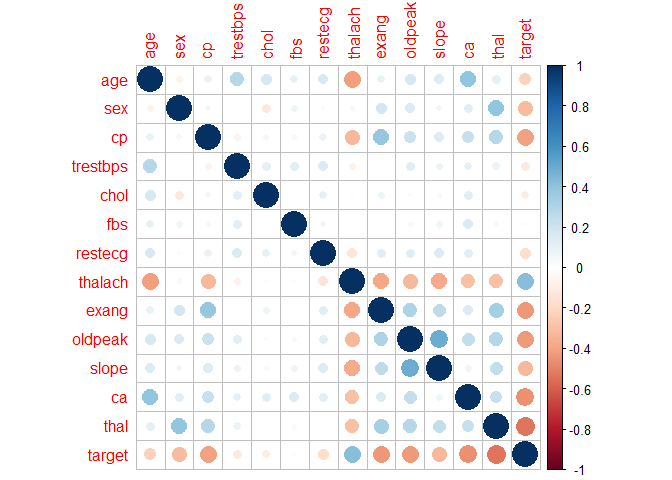
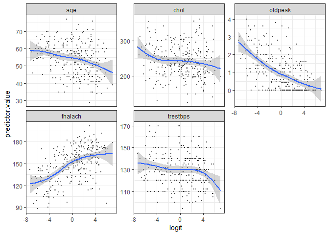
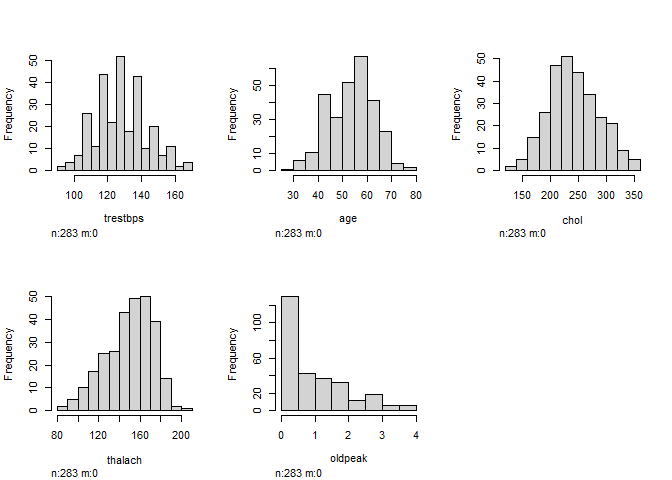
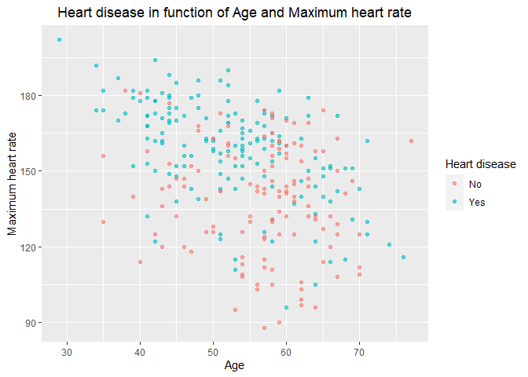

Sandy Vo - Part 2
================
Sandy Vo
7/22/2022

#load the edited data into the R environment

``` r
df <- read.csv("C:/Users/tv/Desktop/Machine learning I/dfex.csv")
```

#Factor categorical variables

``` r
cols <- c("sex","cp","fbs", "restecg", "exang", "slope", "ca", "thal", "target")
df[cols] <- lapply(df[cols], factor)
```

``` r
df_cor <- data.frame(lapply(df,as.integer))
cor(df_cor)
```

    ##                  age         sex          cp     trestbps         chol
    ## age       1.00000000 -0.06411844  0.09031968  0.282668514  0.171015169
    ## sex      -0.06411844  1.00000000  0.05696698  0.007571670 -0.123862629
    ## cp        0.09031968  0.05696698  1.00000000 -0.068998354  0.050929815
    ## trestbps  0.28266851  0.00757167 -0.06899835  1.000000000  0.115138149
    ## chol      0.17101517 -0.12386263  0.05092981  0.115138149  1.000000000
    ## fbs       0.10688535  0.06669202 -0.04457409  0.127221473  0.013065928
    ## restecg   0.16224687  0.02024534  0.08976085  0.150145761  0.103908052
    ## thalach  -0.41110757 -0.04298112 -0.32797521 -0.071600400 -0.020128309
    ## exang     0.09371754  0.18259586  0.38023685  0.001726244  0.076546563
    ## oldpeak   0.17495185  0.15699852  0.21589060  0.121323736 -0.023904114
    ## slope     0.14909476  0.06001370  0.14005434  0.083023835 -0.039351606
    ## ca        0.39213043  0.12248893  0.22068430  0.101059487  0.124799673
    ## thal      0.11962367  0.39943000  0.28362563  0.086159090  0.008069383
    ## target   -0.22241567 -0.31889626 -0.40408439 -0.115614286 -0.105627467
    ##                   fbs      restecg     thalach        exang     oldpeak
    ## age       0.106885347  0.162246875 -0.41110757  0.093717543  0.17495185
    ## sex       0.066692015  0.020245339 -0.04298112  0.182595862  0.15699852
    ## cp       -0.044574089  0.089760851 -0.32797521  0.380236849  0.21589060
    ## trestbps  0.127221473  0.150145761 -0.07160040  0.001726244  0.12132374
    ## chol      0.013065928  0.103908052 -0.02012831  0.076546563 -0.02390411
    ## fbs       1.000000000  0.060602480 -0.02348421  0.006079867  0.04274094
    ## restecg   0.060602480  1.000000000 -0.13856900  0.120455816  0.13006990
    ## thalach  -0.023484209 -0.138569003  1.00000000 -0.387725911 -0.32449301
    ## exang     0.006079867  0.120455816 -0.38772591  1.000000000  0.30580149
    ## oldpeak   0.042740937  0.130069903 -0.32449301  0.305801489  1.00000000
    ## slope     0.069562655  0.141216519 -0.37649399  0.259779890  0.49685436
    ## ca        0.150551754  0.120328693 -0.29648017  0.154768481  0.24396558
    ## thal      0.031154926  0.006527545 -0.29079048  0.334244418  0.28837956
    ## target   -0.027209757 -0.176125687  0.42255908 -0.431599253 -0.42850361
    ##                slope          ca         thal      target
    ## age       0.14909476  0.39213043  0.119623670 -0.22241567
    ## sex       0.06001370  0.12248893  0.399430004 -0.31889626
    ## cp        0.14005434  0.22068430  0.283625629 -0.40408439
    ## trestbps  0.08302384  0.10105949  0.086159090 -0.11561429
    ## chol     -0.03935161  0.12479967  0.008069383 -0.10562747
    ## fbs       0.06956265  0.15055175  0.031154926 -0.02720976
    ## restecg   0.14121652  0.12032869  0.006527545 -0.17612569
    ## thalach  -0.37649399 -0.29648017 -0.290790483  0.42255908
    ## exang     0.25977989  0.15476848  0.334244418 -0.43159925
    ## oldpeak   0.49685436  0.24396558  0.288379559 -0.42850361
    ## slope     1.00000000  0.06788952  0.243087788 -0.32647266
    ## ca        0.06788952  1.00000000  0.221658387 -0.45698920
    ## thal      0.24308779  0.22165839  1.000000000 -0.53032615
    ## target   -0.32647266 -0.45698920 -0.530326154  1.00000000

``` r
library(corrplot)
```

    ## Warning: package 'corrplot' was built under R version 4.1.3

    ## corrplot 0.92 loaded

``` r
corrplot(cor(df_cor))
```

<!-- -->

From the correlation plot, we can see that there is a relatively mild
correlation between predictors such as age and thalach, age and ca, sex
and thal, cp and exang, thalach and exang, slope and oldpeak. So we
expect to see lasso regression shrink some less important coefficients.

Collinearity can be assessed using the R function vif() \[car package\],
which computes the variance inflation factors.

``` r
model <- glm(target ~., data = df, 
               family = binomial)
car::vif(model)
```

    ##              GVIF Df GVIF^(1/(2*Df))
    ## age      1.444690  1        1.201952
    ## sex      1.574992  1        1.254987
    ## cp       1.895174  3        1.112436
    ## trestbps 1.250304  1        1.118170
    ## chol     1.159749  1        1.076917
    ## fbs      1.154072  1        1.074277
    ## restecg  1.156643  2        1.037050
    ## thalach  1.585292  1        1.259084
    ## exang    1.195576  1        1.093424
    ## oldpeak  1.554586  1        1.246830
    ## slope    1.733901  2        1.147509
    ## ca       1.937922  3        1.116579
    ## thal     1.612945  2        1.126951

A VIF value that exceeds 5 or 10 indicates a problematic amount of
collinearity. In this dataset, there is no collinearity since all
predictors have a value of VIF well below 5.

Checking the linear relationship between numerical predictors and the
logit of the response can be done by visually inspecting the scatter
plot between each predictor and the logit values.

``` r
library(broom)
```

    ## Warning: package 'broom' was built under R version 4.1.3

``` r
library(tidyverse)
```

    ## Warning: package 'tidyverse' was built under R version 4.1.3

    ## -- Attaching packages --------------------------------------- tidyverse 1.3.1 --

    ## v ggplot2 3.3.5     v purrr   0.3.4
    ## v tibble  3.1.8     v dplyr   1.0.9
    ## v tidyr   1.2.0     v stringr 1.4.0
    ## v readr   2.1.2     v forcats 0.5.1

    ## Warning: package 'tibble' was built under R version 4.1.3

    ## Warning: package 'tidyr' was built under R version 4.1.3

    ## Warning: package 'readr' was built under R version 4.1.3

    ## Warning: package 'purrr' was built under R version 4.1.3

    ## Warning: package 'dplyr' was built under R version 4.1.3

    ## Warning: package 'stringr' was built under R version 4.1.3

    ## Warning: package 'forcats' was built under R version 4.1.3

    ## -- Conflicts ------------------------------------------ tidyverse_conflicts() --
    ## x dplyr::filter() masks stats::filter()
    ## x dplyr::lag()    masks stats::lag()

``` r
library(ggplot2)
```

``` r
probabilities <- predict(model, type = "response")
predicted <- ifelse(probabilities > 0.5, "Yes", "No")
```

``` r
mydata <- df %>% select_if(is.numeric) %>%
  mutate(logit = log(probabilities/(1-probabilities))) %>%
  gather(key = "predictors", value = "predictor.value", -logit)
```

``` r
ggplot(mydata, aes(logit, predictor.value))+
  geom_point(size = 0.5, alpha = 0.5) +
  geom_smooth(method = "loess") + 
  theme_bw() + 
  facet_wrap(~predictors, scales = "free_y")
```

    ## `geom_smooth()` using formula 'y ~ x'

<!-- -->

The smoothed scatter plots show that variables age, chol, oldpeak,
thalach and trestbps are all quite linearly associated with the diabetes
outcome in logit scale. However, the plot between trestbps and logit has
a wild tail. It is because there is very few points at the tail.

#Check skewed data

The plot below indicates some insights: age, trestbps and chol are
approximately normally distributed.

oldpeak is left-skewed while it is right-skewed for thalach.

``` r
library(Hmisc)
```

    ## Warning: package 'Hmisc' was built under R version 4.1.3

    ## Loading required package: lattice

    ## Loading required package: survival

    ## Loading required package: Formula

    ## 
    ## Attaching package: 'Hmisc'

    ## The following objects are masked from 'package:dplyr':
    ## 
    ##     src, summarize

    ## The following objects are masked from 'package:base':
    ## 
    ##     format.pval, units

``` r
continous_features = c('trestbps','age','chol','thalach','oldpeak') 
hist.data.frame(df[,continous_features])
```

<!-- -->

However, there is no assumption about normality on independent variable
in logistic regression. So the skewness of the numerical predictors is
not problematic.

``` r
ggplot(data = df,aes(x = age, y = thalach, color = target)) + geom_point(alpha = 0.6) + xlab("Age") + ylab("Maximum heart rate") + ggtitle("Heart disease in function of Age and Maximum heart rate") + labs(color = "Heart disease") + theme(plot.title = element_text(hjust = 0.5))
```

<!-- -->

A person gets older, their heart rate decreases. We can see a downward
trend in the plot below.

It seems that maximum heart rate can be strong predictor for heart
disease, regardless of age.
